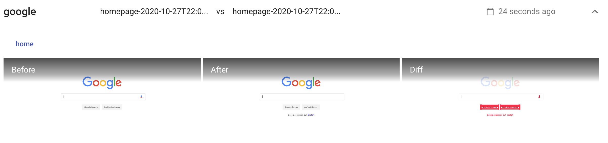

# WhatTheShift

WhatTheShift is a visual regression testing platform. It automates the process of detecting and reviewing visual UI changes.

## Script Mode

Through the web UI you can craft instructions to navigate your publically accessible website and take screenshots.

### Navigation Script

A sequence of URLs to visit and screenshot.

## API Mode

Screenshots can be sent directly to the api or captured and transfered by a supported SDK.

### Rspec Integration

A gem is a available to help with rspec based testing https://github.com/Sinetheta/visdiff-ruby
